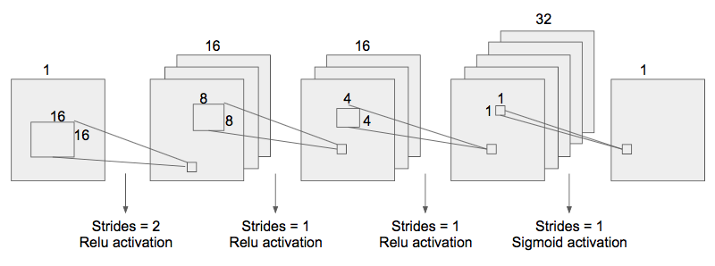
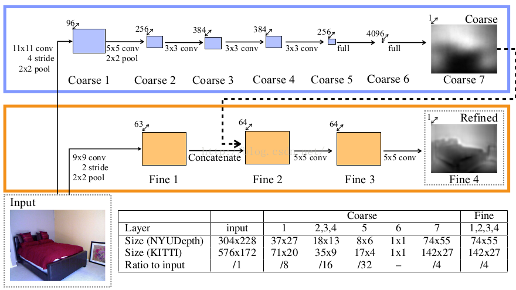

# Models  {#sec:models}

## Simple convolutional network  {#sec:simple}

- `models/simple.py`

The model we built from scratch to get a first grasp on the task consists of four convolutional layers with relu-activation in the first three. We use the larger filter sizes in the first layers (16 and 8) to be able to learn information related on a larger scale. Also, we followed a common approach of firstly increasing filter sizes in order to yield a representation of the features, and then decreasing the sizes to encode these features. To the two dimensional outputs we apply a Mean Squared Error loss function and Adam Optimizer with learning rate 0.0001 to minimize the loss. The network was trained over 2000 epochs on batches of size 32 on the training set of 400 images.

## Multi-Scale Deep Network  {#sec:multiscale}

- `models/multiscale.py`

To use a more elaborated approach, we implemented the structure given by the paper of @Eigen2014. The network is divided into a coarse network to process low level features. The input is also passed into another convolutional network, but after the first layer (and one max pooling layer) the output is concatenated with the output of the coarse network. This leads to a refined depth map of better resolution. However, we wondered whether this coarse network is really necessary, as it is only one of 64 channels at the point of concatenation. The detailed structure can be seen in fig @fig:eigen2014

For training, we again used a MSE loss function and Adam Optimizer. In the paper itself the model is tested on the NYU dataset as well, so we evaluated it on the Make3D dataset. The test images look significantly better to us than the ones of the simple network, but the depth maps remained really blurry.

{height=125%}

## Generative Adversarial Network  {#sec:gan}

- `models/pix2pix.py`

The "Image-to-Image" network features a bottleneck architecture in the generator, by stacking eight convolutional layers with filters until it leaves just one channel, and then using deconvolution for eight layers followed by dropout until the required output image size (in this case the depth map) is reached [@Isola2016]. The network contains so called skip connections between the encoding and the decoding layers, to allow structure information to pass. Furthermore, the output of the generator and the real underlying depth map is then passed into the discriminator with five convolutional layers and one dense layer with sigmoid activation. It outputs one value between 0 and 1 that tells you how "real" the depth map appears to the discriminator.

The loss function used in the paper is a sigmoid cross entropy loss between the output of the discriminator and the desired output (for optimizing the discriminator loss it is desired that the discriminator output is 1 for real and 0 for the generated depth maps). For the generator, in addition to this usual GAN loss, it also takes into account how similar the depth map is to the real underlying depth map. This would make no sense in a GAN without conditional input, but in this case we do not want the generated depth map to look like any real depthmap, but to look like the underlying depth map of the input image. Therefore, the G-loss is the Sigmoid Cross Entropy Loss of the output of the discriminator and 1 (because it should be rated like a real on by D), plus the up-scaled mean of the pixelwise absolute difference between the generated and the real depth map's pixel values.

A significant problem of the network is that it is very large. 16 convolutional layers in the generator plus five layers in the discriminator require a lot of computational power and memory. To avoid memory problems, the authors of the paper propose to take a batch size of one, which might of course lead to other problems as the loss and the derivative are very unreliable over such a small sample. As we trained the network, the results initially were not satisfactory, as the did only contain the structure of the image and not of the depth map, and also lots of checkerboard artifacts. This is a well-known problem of GANs because of the deconvolution: The overlap of strides leads to amplified values in some rows and columns. @Isola2016 tackle this problem by introducing skip connection in the generator -- every layer of the encoder is connected with its *mirrored* version in the decoder. As a matter of fact, this strongly improved the network's performance.

## Generator  {#sec:generator}

**TODO**: Check/extend this section.

In a variation of the pix-to-pix network, we used just the generator and applied a normal Mean Sqared Error loss function to the outputs. Basically it is exactly the same as the GAN, but without the discriminator, i.e. it is a encoder/decoder network with skip connections. We hoped it could be better than the @Eigen2014 model at encoding the information and transforming the images to depth maps, while avoiding the complicated balancing of generator and discriminator. In @fig:generator_graph you can see the structure of the generator's graph.

{height=125%}
