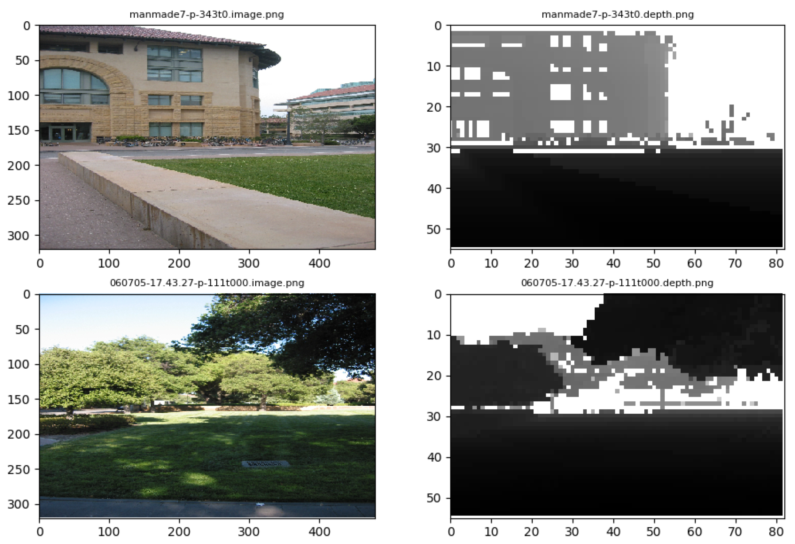

# Codebase Documentation

## Datasets
Datasets follow a common API by inheriting from the `Dataset`^[`datasets/lib/dataset.py`] class. The basic requirement for any of the implemented datasets is that they are self-contained besides the ability to store and read from a local temporary folder `tmp`. When initialized any dataset will check whether required files are already available in that folder and otherwise download them. Similarily they each will extract those files if not done so already. When something goes wrong, the most common fix is to simply delete `tmp`.

When initializing a dataset one can set a couple of options:

* `cleanup_on_exit` (default `False`): If set to `True`, delete files which have been created by this dataset on exit.
* `use_predefined_split` (default `False`): Use the predefined train/test split -- this option will throw an error if there is no predefined split available.
* `test_split` (default `10`): If not using a predefined split, how big of a portion of the images in percantage should be used for testing.
* `workers` (default `4`): Threads to be started for reading & preprocessing the data during usage in a TensorFlow graph.

Note that dataset sizes in the following might differ from the official listings due to some erronous files.

**TODO**: A paragraph about the Ddataviewer class by shoeffner. Which by now was dropped from the shoeffner/ann3depth codebase.

### Make3D
**TODO**: A paragraph about the Make3D dataset. E.g. creator, location and kind of images.

- Image/depth pairs: 523
- View: `python -m datasets.make3d`
- Predefined train/test split available: Yes

### Make3D2
**TODO**: A paragraph about the Make3D2 dataset. E.g. creator, location and kind of images.

- Image/depth pairs: 435
- View: `python -m datasets.make3d2`
- Predefined train/test split available: Yes

### NYU
**TODO**: A paragraph about the Make3D dataset. E.g. creator, location and kind of images.

- Image/depth pairs: 1449
- View: `python -m datasets.nyu`
- Predefined train/test split available: No

### Merged
**TODO**: A paragraph about the merged dataset.

- Image/depth pairs: 2407
- View: `python -m datasets.merged`
- Predefined train/test split available: No

### Inference
The `Inference` dataset diverges from the path of the others -- it does not download any data from the internet but simply provides a shallow layer of access for custom images one wants to run inference on. It reads images of type `gif`, `png` or `jpg` from the `inference` folder (located in the root of this directory) and provides them to the models together with some mock depthmaps (all zeros).

This is of interest when using a pretrained model and wanting to evaluate it on images for one actually does not yet have depth maps. If our approach proves successful, this can also be used to actually generate depthmaps.

## Models

### Simple

### MultiScale

### Pix2Pix

